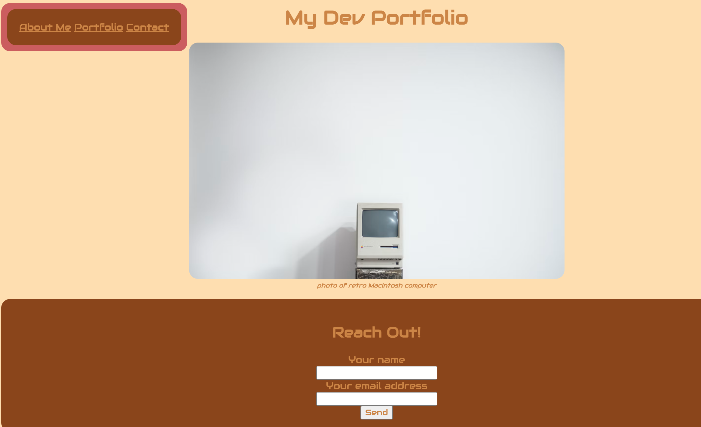
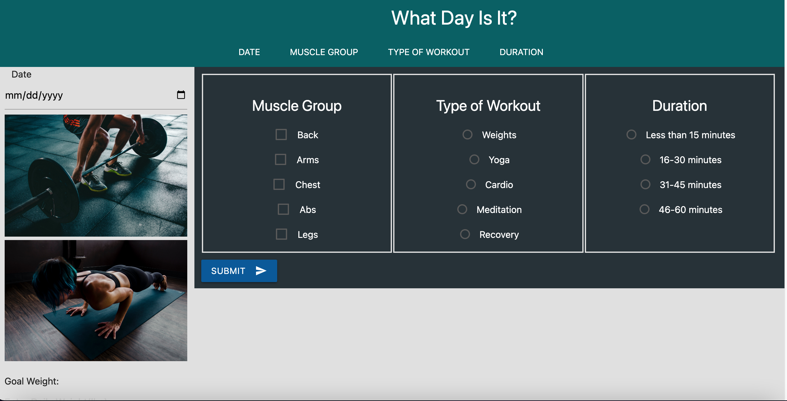

# Profesional Portfolio 

## Introduction ##
As a potential developer, I want to create a professional portfolio.
I will provide samples of my work to be assesed for potential employers.

### What I used 
-HTML
CSS

#### Description 
I am an aspiring developer looking to broden my horizons with my coding journey. I am currently building my portfolio. Please refer to Demo below to see some things I have built and added to my portfolio.

##### Demo 

###### Author :link:
Github; https://github.com/Ashmo91388
